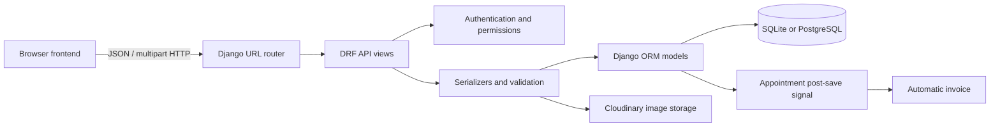
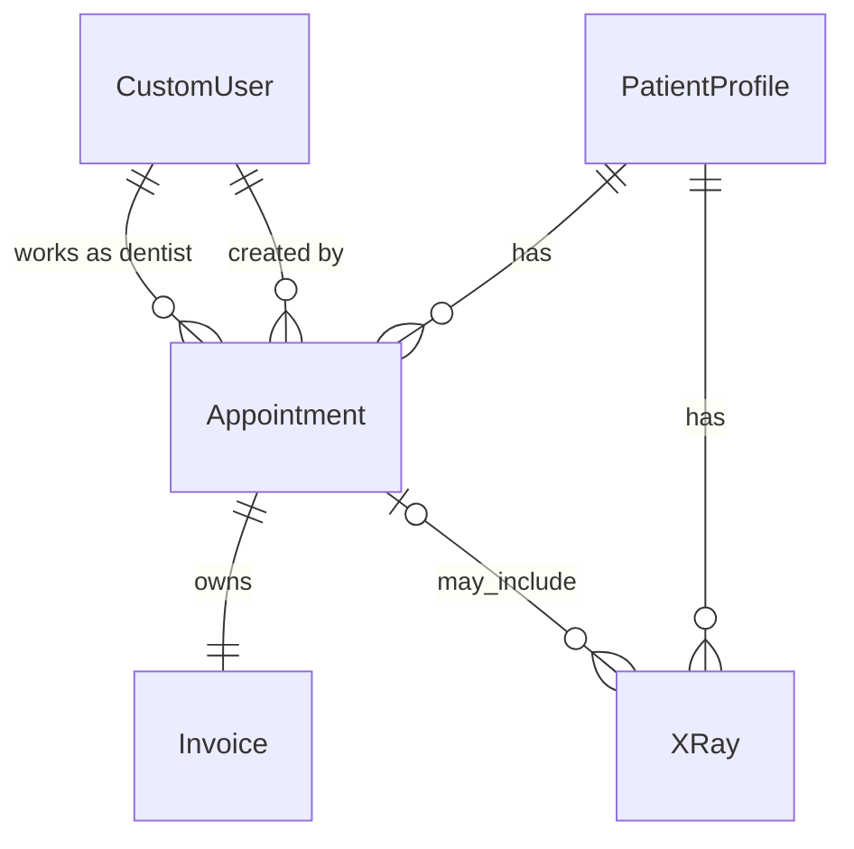
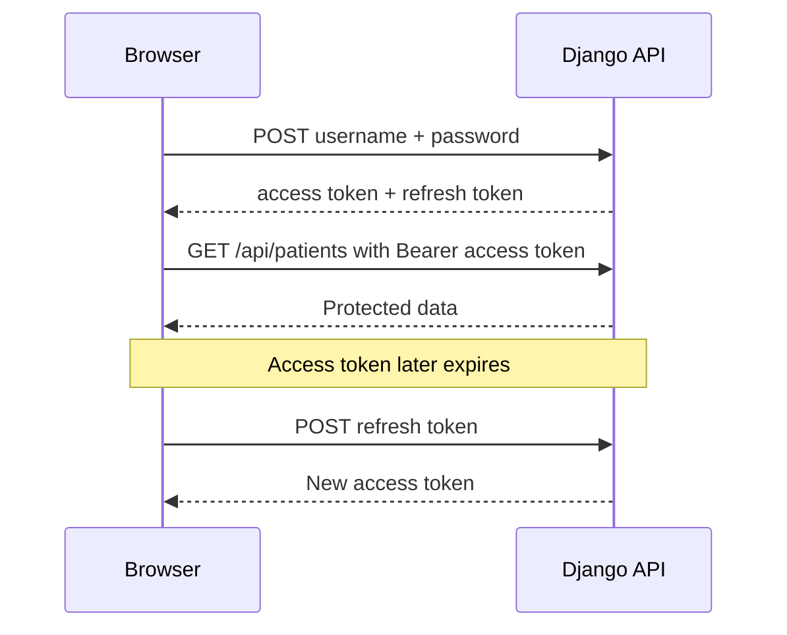

# Dental Clinic Management Hub — Interview Revision Guide

This guide explains the project in plain language so you can revise it before an interview. Do not try to memorize every line. Your goal is to understand:

1. What problem each component solves.
2. How data moves through the system.
3. Why you chose a particular Django or DRF feature.
4. What you would improve in a production version.

---

## 1. Your 60-second project explanation

> Dental Clinic Management Hub is a full-stack clinic management application built with Django and Django REST Framework. It manages staff accounts, patient records, appointments, automatically created invoices, and dental X-rays. The API uses JWT authentication, serializer validation, filtering, and role-aware permissions. X-rays can be stored locally and in Cloudinary, while Docker, PostgreSQL, Gunicorn, and WhiteNoise support deployment. The frontend is a responsive JavaScript single-page interface served by Django. The project has automated API tests using pytest, Factory Boy, and DRF's API client.

If the interviewer asks what makes the project personal or useful:

> My dental background helped me model real workflows such as chief complaints, diagnoses, completed procedures, imaging history, payments, and assigning appointments to dentists.

---

## 2. High-level architecture



The application is a monolithic full-stack Django project. “Monolithic” is not a negative word here. It means the backend, frontend template, static assets, API, and business logic are deployed as one service. This keeps a portfolio project simple to run and deploy.

### Main applications

| Application | Responsibility |
|---|---|
| `accounts` | Staff users, roles, login support, and staff creation |
| `patients` | Patient identity, contact details, and medical information |
| `appointments` | Scheduling, clinical visit details, and invoices |
| `xrays` | X-ray metadata, uploads, cloud URLs, and imports |
| `dental_clinic` | Global settings and root URL routing |
| `templates` and `static` | Browser interface, styling, and frontend behavior |

---

## 3. Important Django concepts used by the project

### Model

A model is a Python class that describes database data. Each model field usually becomes a database column. Django's ORM lets you query models with Python instead of writing raw SQL.

Example:

```python
PatientProfile.objects.filter(full_name__icontains="Ahmed")
```

This produces a case-insensitive database query for matching names.

### Serializer

A DRF serializer has two major jobs:

- Convert model objects into JSON responses.
- Validate incoming JSON or form data before creating or updating objects.

Think of it as the controlled border between the API and the database.

### View

A view receives an HTTP request and returns an HTTP response. This project uses DRF generic views because they provide standard CRUD behavior with less repeated code.

### URL configuration

URL files map paths such as `/api/patients/` to views. The root URL file includes the smaller URL files from each application.

### Permission

A permission decides whether the current user may access an endpoint. Authentication answers “Who is this user?” Permission answers “May this user perform this action?”

### Signal

A signal lets one part of the application react when something happens elsewhere. This project listens for a newly saved appointment and automatically creates its invoice.

### Migration

A migration is Django's version history for database structure. When a model changes, `makemigrations` creates instructions and `migrate` applies them to the database.

---

## 4. Database design



### Relationship vocabulary

- `ForeignKey`: many records can point to one record.
- `OneToOneField`: exactly one related record is expected.
- `related_name`: the reverse Python name used from the other side of a relationship.
- `CASCADE`: deleting the parent deletes its children.
- `SET_NULL`: deleting the parent keeps the child but clears the relationship.

The API intentionally disables patient and appointment deletion, even though some model relationships use `CASCADE`. This prevents normal API users from accidentally removing clinical and financial history.

---

## 5. The `accounts` application

### `accounts/models.py`

#### `CustomUser`

`CustomUser` inherits from Django's `AbstractUser`. This gives it standard fields and behavior such as:

- `username`
- `password`
- `first_name` and `last_name`
- `email`
- `is_staff`, `is_active`, and `is_superuser`
- Password hashing and authentication methods

The project adds:

- `role`: dentist, receptionist, or admin.
- `phone`: staff contact number.
- `specialization`: useful for dentists.
- `license_number`: optional and unique when supplied.

The `is_dentist` and `is_receptionist` properties make role checks readable:

```python
if request.user.is_dentist:
    ...
```

Important setting:

```python
AUTH_USER_MODEL = 'accounts.CustomUser'
```

This tells Django to use this user model instead of the default `auth.User` model.

Interview point: a custom user model should be created near the beginning of a Django project. Changing it after many migrations is much harder.

### `accounts/serializers.py`

`UserSerializer` exposes selected staff fields.

The password field is `write_only=True`. A client may send it, but it is never returned in an API response.

The serializer overrides `create()` because this would be unsafe:

```python
CustomUser.objects.create(password="plain text")
```

Instead, the project calls:

```python
user.set_password(password)
```

`set_password()` hashes the password before it is stored.

`is_staff` is read-only so API users cannot make themselves Django staff by sending it in a request.

### `accounts/permissions.py`

`IsClinicAdmin` allows access when an authenticated user is:

- Django staff,
- a superuser, or
- assigned the custom `admin` role.

This solves an important distinction: Django's `is_staff` flag and the clinic's `role="admin"` are separate concepts.

### `accounts/views.py`

- `RegisterUserView`: creates staff and requires `IsClinicAdmin`.
- `StaffListView`: lists staff for authenticated users.
- `CurrentUserView`: returns the signed-in user's profile for the frontend.
- `DentistListView`: returns only users whose role is `dentist`.

`DentistListView` supports search and uses `.only(...)` to request only required database columns. This can reduce unnecessary data transfer from the database.

### `accounts/urls.py`

Important endpoints:

| Method | Endpoint | Purpose |
|---|---|---|
| POST | `/api/accounts/login/` | Exchange username/password for JWT tokens |
| POST | `/api/accounts/token/refresh/` | Exchange refresh token for a new access token |
| GET | `/api/accounts/me/` | Return current staff member |
| GET | `/api/accounts/staff/` | List clinic staff |
| GET | `/api/accounts/dentists/` | List dentists |
| POST | `/api/accounts/register/` | Create a staff account |

---

## 6. JWT authentication flow

JWT means JSON Web Token.



The access token is short-lived and is attached to API requests:

```http
Authorization: Bearer <access-token>
```

The refresh token is used to obtain a new access token without asking for the password again.

The frontend stores both in `sessionStorage`. This means they survive navigation and refreshes in the same tab, but are cleared when the browser session ends. An advanced discussion may mention that JavaScript-accessible storage can be exposed by an XSS vulnerability. HttpOnly secure cookies are another architecture with different CSRF considerations.

---

## 7. The `patients` application

### `patients/models.py`

`PatientProfile` stores:

- Identity and contact information.
- Date of birth and blood type.
- Allergies and medical notes.
- Creation and update timestamps.

`age` is a Python property calculated from `date_of_birth`.

Why not store age directly?

Age changes over time. If it were stored, it would become incorrect unless continuously updated. Date of birth is stable, so age should be calculated when needed.

`Meta.ordering = ['full_name']` gives patient queries a default alphabetical order.

### `patients/serializers.py`

`PatientSerializer` includes the calculated `age` as read-only.

`validate_phone()` permits digits and common phone characters. Serializer field validation runs before saving, so invalid input returns HTTP 400 instead of entering the database.

### `patients/views.py`

`PatientListCreateView` supports:

- GET to list patients.
- POST to create a patient.
- Search by name, phone, or email.
- Ordering by name or creation time.

`PatientDetailView` uses `RetrieveUpdateAPIView`, not a destroy view. It permits GET, PUT, and PATCH but deliberately prevents DELETE.

`PatientSearchView` is a smaller search endpoint intended for patient selectors. It returns only identifying fields and supports `?q=` searching.

### PUT versus PATCH

- PUT means replace the complete resource representation.
- PATCH means update only supplied fields.

The frontend mainly uses PATCH for editing because it does not need to resend every field.

---

## 8. The `appointments` application

### `appointments/models.py`

#### `Appointment`

An appointment belongs to:

- One patient.
- One dentist.
- The staff member who created it.

It stores both scheduling and clinical information:

- `date_time`
- `chief_complaint`
- `diagnosis`
- `procedures_done`
- `notes`
- `status`

There are two foreign keys to `CustomUser`: `dentist` and `created_by`. They need different `related_name` values to avoid reverse-relation name collisions.

`created_by` uses `SET_NULL`. If that user is removed, the appointment remains as a clinical record.

#### `Invoice`

An invoice has a one-to-one relationship with an appointment. Therefore each appointment has at most one invoice, and code can use:

```python
appointment.invoice
```

Money uses `DecimalField`, not floating point. Decimal arithmetic avoids binary floating-point rounding problems for financial values.

`balance` is calculated:

```python
total_fees - amount_paid
```

### `appointments/signals.py`

The `post_save` receiver runs after an appointment is saved. It checks the `created` flag, so an invoice is created only on the first save:

```python
if created:
    Invoice.objects.create(appointment=instance)
```

This enforces the rule that every new appointment gets an invoice, regardless of which view or script created it.

Tradeoff: signals can hide behavior because the invoice creation is not visible where the appointment is created. In a larger system, a service layer or explicit transaction may be easier to trace. For this project, the signal is small and covered by tests.

### `appointments/apps.py`

`AppointmentsConfig.ready()` imports `signals`. Django must import the module so the receiver is registered when the application starts.

### `appointments/serializers.py`

#### `DentistField`

This custom related field restricts possible dentist IDs to users with `role="dentist"`. A receptionist cannot be assigned as the treating dentist even if the client manually changes the request.

#### `InvoiceSerializer`

It validates that `amount_paid` is not greater than `total_fees` and automatically sets status:

| Condition | Status |
|---|---|
| Paid is zero | `unpaid` |
| Paid is below total | `partial` |
| Paid equals total | `paid` |

This business rule belongs in backend validation because the frontend cannot be trusted as the only validator.

#### `AppointmentSerializer`

The serializer accepts IDs for writing:

- `patient`
- `dentist`

It also includes nested read-only details:

- `patient_detail`
- `dentist_detail`
- `invoice`

This is a useful API pattern: compact IDs for writes and convenient nested information for reads.

Validation prevents:

- Scheduling in the past.
- Assigning a non-dentist.
- Two scheduled appointments for the same dentist at the exact same time.

Important limitation: the model has no appointment duration. Therefore it prevents identical start times, not all overlaps. A production improvement would add `duration_minutes` or `end_time` and reject intersecting time ranges.

### `appointments/views.py`

`AppointmentListCreateView` uses:

- `DjangoFilterBackend` for exact filters such as status, dentist, and patient.
- `SearchFilter` for names and complaint text.
- `OrderingFilter` for date and creation order.

`perform_create()` sets `created_by` from `request.user`. The client cannot pretend that another user created the appointment.

The query uses `select_related('patient', 'dentist', 'invoice')`.

Without it, serializing a list could execute additional queries for every appointment. This is the N+1 query problem. `select_related` joins single-valued relationships in the main query.

`AppointmentDetailView` does not allow DELETE, protecting the related invoice and clinical history.

`InvoiceDetailView` retrieves an invoice through its appointment ID. There is no invoice creation endpoint because the signal creates it automatically.

---

## 9. The `xrays` application

### `xrays/models.py`

`xray_upload_path()` organizes local files by patient:

```text
media/xrays/patient_3/image.jpg
```

`XRay` belongs to one patient and may optionally belong to an appointment.

The optional appointment relationship uses `SET_NULL`. If an appointment were removed internally, the image could still remain in the patient's history.

Important fields:

- `image_local`: Django image field.
- `image_cloud`: persistent Cloudinary URL.
- `storage_type`: local, cloud, or both.
- `source`: manual upload or automated import.
- `external_id`: identifier from another imaging system.
- `taken_at` and `imported_at`: clinical acquisition time versus system import time.

### `xrays/serializers.py`

The API accepts an uploaded file through the write-only `image_file` field.

Validation ensures that an attached appointment belongs to the selected patient. This prevents inconsistent records such as placing Patient A's X-ray under Patient B's appointment.

During creation:

1. The file is assigned to `image_local`.
2. If Cloudinary is enabled, the same stream is uploaded to Cloudinary.
3. `image_cloud` and `storage_type="both"` are stored.
4. The stream is rewound with `seek(0)` because Cloudinary may have consumed it before Django saves the local copy.
5. In production, a Cloudinary failure returns a validation error instead of silently creating a record that will break after a Render restart.

Why does the frontend prefer `image_cloud`?

Render's normal filesystem is ephemeral. A local file can disappear after a restart or redeployment. Cloudinary is persistent, so the browser chooses the cloud URL first.

### `xrays/views.py`

`XRayListCreateView` can filter with:

- `?patient=3` for a patient's complete history.
- `?appointment=10` for images attached to one visit.

`XRayDetailView` supports retrieval and deletion, but not editing. The design treats an X-ray as a clinical record that should not be silently modified after upload.

`perform_destroy()` removes the database row and local storage file.

Current limitation: deleting a record does not delete the remote Cloudinary resource because the model stores only its URL, not Cloudinary's `public_id`. A production improvement would store `cloud_public_id` and call Cloudinary's destroy API.

### `import_xrays.py`

This custom management command imports X-ray metadata from JSON:

```bash
python manage.py import_xrays --source xray_data.json
python manage.py import_xrays --source xray_data.json --dry-run
```

The command:

1. Checks that the file exists.
2. Loads JSON records.
3. Finds a patient by name.
4. Skips an already imported external ID.
5. Creates cloud X-ray records.
6. Prints imported, skipped, and error totals.

`--dry-run` previews the work without saving.

Tradeoff: matching patients by partial name can be ambiguous. A real integration should use a stable patient identifier shared between systems.

---

## 10. Settings and project configuration

### Environment variables

Secrets and deployment-specific values belong in environment variables rather than source code.

Important variables include:

- `SECRET_KEY`
- `DEBUG`
- `ALLOWED_HOSTS`
- `DATABASE_URL`
- Cloudinary credentials or `CLOUDINARY_URL`
- `XRAY_CLOUD_UPLOAD_ENABLED`
- Optional superuser variables

The `.env` file is ignored by Git because it may contain secrets.

### Database configuration

Local development can use SQLite. Deployment can use a PostgreSQL `DATABASE_URL`.

SQLite is convenient because it needs no separate server. PostgreSQL is more suitable for a deployed multi-user application because it provides stronger concurrency and production database features.

### DRF configuration

The global defaults are:

- JWT authentication.
- Authenticated access required.
- Django Filter integration.

Global authentication is safer than accidentally leaving every new endpoint public. Public endpoints, such as login, explicitly provide their own permission behavior through the SimpleJWT view.

### Static files versus media files

- Static files are application assets: CSS, JavaScript, and icons.
- Media files are user uploads: X-rays.

WhiteNoise serves collected static assets with Gunicorn. Cloudinary provides persistent media storage. These are different problems and should not be confused.

### Templates

`TEMPLATES['DIRS']` includes the project-level `templates` directory. `STATICFILES_DIRS` includes the project-level `static` directory.

### Root URLs

`dental_clinic/urls.py` maps API prefixes to each application. It also maps browser paths such as `/patients/` and `/appointments/` to the same frontend template. JavaScript reads the browser path and renders the appropriate screen.

In development, Django may serve media directly. That is not a persistent production storage solution.

### Database profiling with Django Silk

Silk is integrated as an opt-in development profiler. It records request duration, executed SQL, query counts, duplicate queries, and time spent in the database.

Enable it only in your local `.env`:

```text
ENABLE_SILK=True
```

Then prepare its database tables and start Django:

```bash
python manage.py migrate
python manage.py runserver
```

Sign in to Django admin with a staff/superuser account, then open:

```text
http://localhost:8000/silk/
```

Useful profiling workflow:

1. Clear or note the existing Silk requests.
2. Open one application page, such as appointments.
3. Find its API request in Silk.
4. Check total query count and SQL time.
5. Look for the same query repeated for every row, which suggests an N+1 problem.
6. Optimize with `select_related`, `prefetch_related`, annotations, or fewer API calls.
7. Repeat the exact request and compare measurements.

Silk is disabled by default and its dashboard requires a Django staff session. It must remain disabled on Render because profiling data may contain request and SQL information and profiling adds runtime overhead.

---

## 11. Frontend architecture

The frontend uses:

- One Django template: `templates/index.html`.
- CSS in `static/css/`.
- Vanilla JavaScript in `static/js/app.js`.
- The browser Fetch API for backend requests.

It behaves like a small single-page application. The page shell remains loaded while JavaScript replaces the contents of `<main>`.

### Important frontend sections

#### State

The `state` object caches the current user, patients, dentists, appointments, staff, and X-rays.

#### Routing

`viewPaths` maps frontend view names to URLs. `history.pushState()` changes the visible URL without performing a full page reload. The `popstate` listener supports browser back and forward buttons.

#### API wrapper

`request()` centralizes API communication:

1. Adds the JWT Authorization header.
2. Adds JSON content type when appropriate.
3. Parses responses.
4. Refreshes an expired access token once.
5. Throws readable errors for the UI.

Centralizing this avoids repeating authentication code in every screen.

#### Rendering

Functions such as `renderPatients()`, `renderAppointments()`, and `renderXrays()` request data and produce HTML for the main content area.

#### Event delegation

One document click listener looks for `data-action` attributes and dispatches actions. This works well for HTML created dynamically after the initial page load.

#### XSS protection

`escapeHtml()` escapes dynamic text before inserting it into HTML templates. Without this, a malicious value such as a patient name containing HTML or JavaScript could execute in another user's browser.

#### Patient search controls

The frontend uses a searchable datalist label and converts the selected label back to a patient ID. The backend still receives a numeric foreign key.

#### Upload lock

The X-ray form sets `data-submitting="true"` and disables its submit button during upload. This prevents repeated clicks from creating duplicate records.

#### Image display

Thumbnails use `object-fit: contain` so the complete X-ray is visible rather than cropped. Clicking a preview opens a larger modal and offers the original image URL.

### Frontend limitation

`app.js` is now large. A natural next step would be ES modules such as:

```text
static/js/
├── api.js
├── auth.js
├── router.js
├── patients.js
├── appointments.js
└── xrays.js
```

That would improve maintainability without requiring a frontend framework.

---

## 12. Complete request flows

### Creating a patient

```text
User submits form
→ JavaScript builds JSON
→ POST /api/patients/
→ JWT authentication checks the user
→ PatientSerializer validates fields
→ PatientProfile is saved
→ Serializer returns JSON
→ Frontend closes modal and reloads patient list
```

### Booking an appointment

```text
User searches and selects patient
→ Frontend converts selection to patient ID
→ POST /api/appointments/
→ DentistField checks selected user is a dentist
→ Serializer checks future time and exact-time conflict
→ View sets created_by to request.user
→ Appointment is saved
→ post_save signal creates Invoice
→ Response includes patient, dentist, and invoice details
```

### Uploading an X-ray

```text
User selects patient, optional appointment, and image
→ Button is locked to prevent duplicates
→ Browser sends multipart/form-data
→ Serializer checks appointment belongs to patient
→ Cloudinary upload creates persistent URL
→ Local and cloud information is saved
→ Response identifies storage_type
→ Frontend prefers cloud URL when displaying image
```

### Updating an invoice

```text
User enters total and paid amount
→ PATCH /api/appointments/<id>/invoice/
→ Serializer prevents overpayment
→ Serializer derives unpaid/partial/paid status
→ Invoice is saved
→ Updated balance is returned
```

---

## 13. Docker and deployment

### `Dockerfile`

The image:

1. Starts from Python 3.11 slim.
2. Disables bytecode files and buffered logging.
3. Installs PostgreSQL/Pillow build dependencies.
4. Installs Python requirements.
5. Copies the project.
6. starts `entrypoint.sh`.

Requirements are copied before source code to improve Docker layer caching. Dependencies are reinstalled only when `requirements.txt` changes.

### `docker-compose.yml`

Compose defines:

- A PostgreSQL database service.
- A Django/Gunicorn web service.
- Persistent PostgreSQL and local media volumes for Docker development.

`depends_on` controls startup order but does not guarantee PostgreSQL is ready to accept connections. A more advanced deployment can use a database health check or retry script.

### `entrypoint.sh`

At container startup it:

1. Collects static files.
2. Applies database migrations.
3. Optionally creates a superuser from environment variables.
4. Starts Gunicorn on the platform's `PORT`.

`set -e` stops startup when a command fails. This is preferable to running a partially initialized application.

### Gunicorn

Django's development server is not intended for production. Gunicorn is a production WSGI server that runs the Django application.

### Render and media persistence

Render's standard filesystem is ephemeral. PostgreSQL persists database rows, but a local uploaded file may disappear after a deploy. Cloudinary is used for persistent X-ray images. Existing local-only images cannot be recovered after the platform removes them.

---

## 14. Automated tests

The project uses:

- `pytest`
- `pytest-django`
- DRF `APIClient`
- `factory_boy`
- Faker

### Why factories?

Factories create realistic model objects with sensible defaults. Tests can override only the values relevant to a scenario.

Example idea:

```python
dentist = DentistFactory()
patient = PatientProfileFactory()
```

### What the tests cover

- Admin and non-admin staff registration.
- JWT login.
- Current-user endpoint.
- Patient creation, search, validation, and deletion protection.
- Appointment creation and automatic invoices.
- Past-date and dentist-role validation.
- Exact-time double-booking prevention.
- Invoice payment states and overpayment.
- X-ray uploads, filters, patient/appointment consistency, deletion, and Cloudinary behavior.
- JSON import, duplicates, errors, and dry runs.

### Useful test commands

```bash
pytest -q
pytest accounts/tests.py -q
pytest appointments/tests.py::TestAppointmentCreation -q
```

Testing lesson: test behavior, not implementation details. For example, the signal test verifies that an invoice exists after appointment creation. It does not need to test Django's internal signal machinery.

---

## 15. HTTP status codes used in the project

| Code | Meaning | Example |
|---|---|---|
| 200 | Successful GET or update | Fetch patient, update invoice |
| 201 | Resource created | Create patient or appointment |
| 204 | Successful response without body | Delete X-ray |
| 400 | Invalid client data | Past appointment or overpayment |
| 401 | Missing/invalid authentication | No JWT token |
| 403 | Authenticated but forbidden | Receptionist creating staff |
| 404 | Resource not found | Unknown patient ID or missing file |
| 405 | HTTP method not supported | Attempt to delete appointment |

---

## 16. Strengths you can confidently discuss

- Clear separation into domain-focused Django applications.
- Custom user model and clinic roles.
- JWT authentication with refresh handling.
- Backend validation rather than trusting the browser.
- Efficient relationship queries with `select_related`.
- Automatic invoice rule covered by tests.
- Decimal-based financial calculations.
- Search, filters, and ordering.
- Multipart file upload and persistent cloud media.
- Dockerized deployment.
- Responsive frontend connected to real APIs.
- Automated tests for normal and failure paths.

---

## 17. Limitations and professional answers

An interviewer is usually impressed when you can identify limitations without becoming defensive.

### Role permissions are still broad

Most clinical endpoints require authentication, but they do not yet fully separate what dentists and receptionists may edit.

Good answer:

> I would add action-specific permissions. Receptionists could manage scheduling and patient contact information, while dentists could update diagnoses and procedures. Financial access could be limited to authorized roles.

### No audit log

Medical applications should record who changed sensitive information and when.

Good answer:

> I would add an append-only audit model or a proven history package, including actor, timestamp, object, action, and changed fields.

### No patient archive field

Deletion is disabled, but the system does not yet support marking a patient inactive.

Good answer:

> I would use soft deletion or an `is_active`/`archived_at` field so records remain available for legal and clinical history.

### Scheduling checks only identical times

Good answer:

> I would add appointment duration and detect overlapping intervals. I would also add a database-level strategy or transaction locking to handle simultaneous booking requests.

### Concurrent requests

Application-level `.exists()` validation can have a race condition if two requests pass the check simultaneously.

Good answer:

> For exact times I could add a conditional database uniqueness constraint. For time ranges I would use transactions and PostgreSQL exclusion constraints or another concurrency-safe scheduling design.

### Cloud deletion

The local file is deleted, but the Cloudinary resource is not yet removed.

Good answer:

> I would store Cloudinary's public ID and destroy the remote asset when an authorized deletion occurs, while keeping an audit record.

### Currency is fixed in the frontend

The JavaScript formatter currently uses USD. A real clinic needs configurable currency and locale.

### Privacy and compliance

Do not claim the project is HIPAA/GDPR compliant.

Good answer:

> It demonstrates security-conscious patterns, but compliance requires much more: contracts with providers, encryption policies, access audits, backups, retention rules, incident response, consent, and jurisdiction-specific review.

---

## 18. Common interview questions and answers

### Why did you use Django REST Framework?

DRF provides serializers, authentication integration, permissions, generic views, filtering, status handling, and test utilities. It reduced repetitive API code while keeping validation explicit.

### Why use a custom user model?

Clinic staff need domain fields such as role, specialization, and license number. Starting with `AbstractUser` keeps Django's secure authentication behavior while allowing extension.

### Why are serializers important?

They define the API representation and validate untrusted input before it reaches the database. They also support computed and nested read-only fields.

### Why do you validate on the backend if the frontend validates?

The frontend can be bypassed with tools such as curl or Postman. The backend is the trusted enforcement point. Frontend validation is mainly for user experience.

### What is the N+1 query problem?

It happens when one list query is followed by another related query for every row. `select_related` fetches foreign-key and one-to-one data in the original query.

### What is the difference between `select_related` and `prefetch_related`?

`select_related` uses SQL joins and is suited to foreign-key/one-to-one relationships. `prefetch_related` runs additional queries and combines results in Python, which is suited to many-to-many and reverse-many relationships.

### Why use `DecimalField` for money?

Binary floating point cannot exactly represent many decimal values. Decimal arithmetic gives predictable base-10 financial calculations.

### Why use a signal for invoices?

It guarantees an invoice is created whenever an appointment is created through Django. The behavior is small and tested. In a larger application I might use an explicit service layer for visibility and transaction control.

### What does `related_name` do?

It defines the reverse relationship. For example, `patient.appointments.all()` uses the appointment foreign key's `related_name`.

### What is JWT?

It is a signed token containing claims. The server verifies the signature rather than looking up a session for every request. This project uses separate access and refresh tokens.

### What is the difference between authentication and authorization?

Authentication verifies identity. Authorization determines what that identity is allowed to do.

### What is `perform_create()` used for?

It adds server-controlled data during creation. This project uses it to set `created_by=request.user` rather than trusting a client-provided user ID.

### Why is X-ray upload multipart rather than JSON?

Binary files are normally transferred with `multipart/form-data`. JSON is used for structured text data but does not directly carry normal file streams.

### Why does Render lose local images?

Its ordinary application filesystem is ephemeral. Database and external object-storage services persist independently. That is why cloud storage is used for deployed media.

### Why Docker?

Docker defines a repeatable runtime with the Python version, operating-system packages, dependencies, and startup command. It reduces “works on my machine” differences.

### Why test failure paths?

Real reliability comes from rejecting invalid states, not only accepting valid ones. The suite tests unauthorized access, invalid phones, past dates, wrong roles, overpayment, mismatched patients, and duplicate imports.

---

## 19. Commands worth knowing

```bash
# Run development server
python manage.py runserver

# Check project configuration
python manage.py check

# Create and apply model migrations
python manage.py makemigrations
python manage.py migrate

# Create administrator interactively
python manage.py createsuperuser

# Run tests
pytest -q

# Collect production static files
python manage.py collectstatic --noinput

# Import X-ray metadata
python manage.py import_xrays --source xray_data.json --dry-run

# Docker development
docker compose up --build
```

---

## 20. Supporting files you should recognize

### `manage.py`

This is Django's command-line entry point. It sets `DJANGO_SETTINGS_MODULE` and passes commands such as `runserver`, `migrate`, and `createsuperuser` to Django.

### `wsgi.py` and `asgi.py`

- `wsgi.py` exposes the synchronous WSGI application used by Gunicorn.
- `asgi.py` exposes the ASGI application used by ASGI servers and is relevant to async features such as WebSockets.

This deployment currently runs the WSGI application.

### `admin.py` files

These register models with Django's built-in administration site and improve its lists, filters, search, and forms.

- Custom staff fields extend Django's `UserAdmin`.
- Patient admin supports name/contact search and blood-type filters.
- Appointment admin displays its invoice inline.
- X-ray admin supports storage/source filtering and patient searches.

The admin site is useful for trusted internal maintenance; it is separate from the custom clinic frontend.

### `factories.py` files

Factory Boy classes create test data. `SubFactory` automatically creates related objects, `Sequence` creates unique values, and Faker creates realistic example values. The user factory calls `set_password()` so test users can authenticate normally.

### `tests.py` files

Tests are grouped by domain. `@pytest.mark.django_db` permits database access, setup methods create fresh authenticated clients, and assertions check HTTP responses plus resulting database state.

### `migrations/`

Migration files are generated schema history. They allow every environment to build the same database structure. They should be committed to Git. Normally you change models and let Django generate migrations rather than editing applied migrations manually.

### `apps.py`

Each app configuration identifies the Django application. The appointments config also loads signal receivers during startup.

### `__init__.py`

These small files mark directories as Python packages. They are often empty.

### `requirements.txt`

This pins the Python packages needed by the project. Pinning improves repeatable environments and prevents a newly released incompatible dependency from unexpectedly breaking deployment.

### `pytest.ini`

This tells pytest which Django settings module and test filename patterns to use. `--reuse-db` speeds repeated test runs by reusing the test database structure.

### `README.md` and `API_DOCUMENTATION.md`

The README introduces the project and setup. API documentation describes endpoints and example payloads. This interview guide focuses on understanding and explaining the implementation.

### `xray_data.json`

This is sample input for the X-ray import management command.

### `db.sqlite3`

This is the local SQLite database file. It is convenient for development but should not be treated as the deployed PostgreSQL database or as a source-code file containing safe portfolio data.

---

## 21. Quick glossary

| Term | Simple meaning |
|---|---|
| API | A controlled way for software components to communicate |
| ORM | Maps Python model operations to database SQL |
| CRUD | Create, read, update, delete |
| JWT | Signed token used for authentication |
| Serializer | Converts and validates API data |
| Middleware | Code that processes requests/responses globally |
| WSGI | Standard interface between Python web apps and servers |
| Gunicorn | Production WSGI server |
| WhiteNoise | Serves collected static files from Django deployment |
| Foreign key | Many-to-one database relationship |
| One-to-one | Relationship allowing one related record |
| Signal | Event notification inside Django |
| Migration | Versioned database schema change |
| Queryset | Lazy description of a database query |
| XSS | Injection of scripts into another user's browser |
| CSRF | Forcing a browser to submit an unwanted authenticated request |
| Ephemeral disk | Filesystem whose contents can disappear after restart/deploy |

---

## 22. Final revision checklist

Before an interview, make sure you can explain without reading:

- [ ] The four Django applications and their responsibilities.
- [ ] The relationship between patient, appointment, invoice, dentist, and X-ray.
- [ ] How JWT login and refresh work.
- [ ] Why passwords use `set_password()`.
- [ ] How serializers protect the database.
- [ ] How an appointment automatically receives an invoice.
- [ ] Why `select_related` is used.
- [ ] Why money uses Decimal.
- [ ] How X-ray upload reaches Cloudinary.
- [ ] Why Render cannot keep local uploads reliably.
- [ ] How frontend requests attach authentication.
- [ ] How tests authenticate and create factory data.
- [ ] At least three current limitations and how you would improve them.

The best interview approach is not “my project is perfect.” It is:

> I can explain the decisions I made, demonstrate that the important behavior is tested, and identify the next production improvements.
